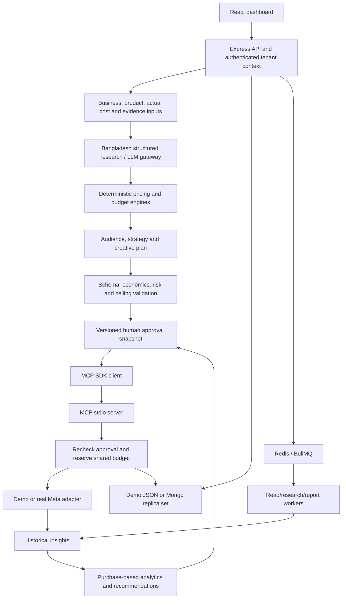
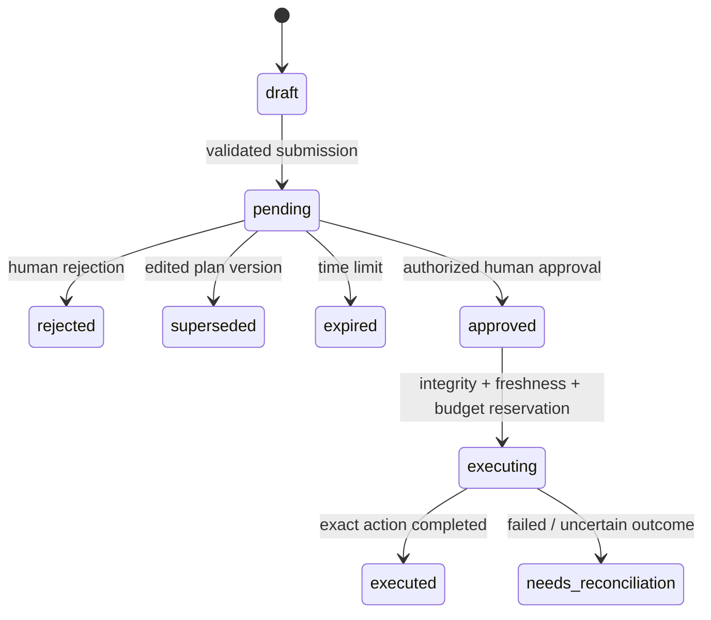

# Engineering design

## Scope and requirements

The source document is archived in `source-requirements.txt`. Its Phase 1 is the Bangladesh physical-product workflow on Meta, with human approval. A later user request explicitly expands this to independent client workspaces, private media uploads, iterative international research and service/software website lead/purchase campaign drafts. Subscription lifetime-value modeling, autonomous paid changes and other advertising adapters remain future scopes. The implementation uses the requested Node/Express, JavaScript, Mongoose, Redis/BullMQ stack. See `workspaces-media-research.md` for the expansion's boundaries.

The development sequence was: requirements capture → module boundaries → deterministic economics → evidence labeling → campaign validation → approval state machine → transactional action reservation → MCP/Meta adapters → dashboard → automated acceptance and failure-path checks → deployment runbook.

## Runtime flow



## Boundaries and trust

`src/modules/` owns business logic. `src/ai/` handles untrusted provider output; it never receives Meta tokens or MCP service credentials. LLM-generated research is downgraded to AI-generated assumptions even when the provider claims it verified data. Human-added sourced observations are explicitly attested by a stored user ID. User input does not become an instruction to an action tool.

`src/mcp/` is a narrow interface. Mutation tools take only an approval UUID; arbitrary budgets, account IDs, targeting, or free-form instructions cannot be passed through. MCP calls a service-key-protected internal API, which loads the approved snapshot from storage. The browser never receives the MCP key or Meta token.

`src/integrations/meta/` normalizes HTTP errors and only retries reads. Mutations have uncertain outcomes after timeouts, so blind retry is prohibited. The adapter records each remote campaign, ad-set, creative and ad ID as soon as Meta returns it.

## Approval lifecycle



Approval hashes cover the immutable plan snapshot and the exact action envelope (action type, payload, target campaign, state hash, IDs, and expiry). Approval and execution separately check the product snapshot, business policy, integration binding, permissions and expiry. Plan edits supersede pending approvals instead of mutating them. Rejecting or editing does not perform any Meta action.

Pause is an explicit safety exception to product freshness: a previously launched campaign can still be paused through new human approval when costs/inventory changed. The exact campaign state and pause action are still bound to the approval. Resume, scaling, and launches require fresh economics and policy. A repeated completed approval returns its existing result; simultaneous repeats cannot create another campaign.

## Budget reservation and transaction design

Daily reservations include active, provisioning and reconciliation-required campaigns. Total reservations include every allocated campaign spend cap, including paused campaigns: pausing does not recycle capital that may already have been spent. Budget changes keep the existing campaign total spend cap and end time. Administrators can explicitly enlarge the business policy when more capital is available; changed policy invalidates old recommendations.

The execution transaction updates the shared business `budgetVersion`, inserts/updates the campaign reservation, transitions the approval to executing, and appends an audit event. A Mongo write conflict on the shared business row forces competing transactions to retry against the newer reservation. A unique index on `campaigns.approvalId` supplies an additional duplicate-launch barrier. External Meta calls happen after the transaction; they cannot be rolled back, so progress is checkpointed and partial failure retains the reservation.

The demo store uses an asynchronous mutex and copy-on-write transaction; failed callbacks never replace the state. State commits via a temporary file rename. It is explicitly a single-process development adapter. A second process writing the same JSON file is unsupported.

## Economics

Let `r` be unsuccessful order rate, `L` loss per unsuccessful order, `f` proportional payment fee, `C` the product/packaging/delivery/fixed-payment/operations cost, and `P` selling price.

```
Expected failure loss per delivered order = r / (1 - r) × L
Base variable cost = C + expected failure loss
Contribution before ads = P × (1 - f) - base variable cost
Required profit = max(minimum profit, P × desired margin)
Allowable / target CPA = max(0, contribution before ads - required profit)
Break-even ROAS = P / contribution before ads, when contribution > 0
Target ROAS = P / target CPA, when target CPA > 0
```

Products with nonpositive ad allowance or empty inventory cannot be approved. Missing competitor prices remain null. Recommended ad allowance and expected purchases are planning assumptions, not observed market conversion cost or guaranteed outcome.

## Data model and analytics

All named collections from the brief exist, plus expiring sessions, workspace memberships, private media metadata, research projects/versions and service offers. IDs are UUID strings. HTTP/service inputs are validated with Zod; Mongoose supplies base identity/tenant/index contracts and stores versioned structured recommendation documents. Unique membership and project/version indexes protect client context and research numbering. Expand per-field schema migrations before supporting new external writers.

Performance uniqueness is `(campaignId, level, entityId, date)`, so repeated synchronization updates existing snapshots. Purchase action aliases are selected once, never summed as if they were independent conversions. Unknown revenue and division by zero yield null. Reach and frequency are not summed across days or campaigns; aggregate views show them as unknown until a deduplicated range report exists.

Optimization compares CPA against allowable CPA, requires purchase evidence for scaling, and caps the proposed initial scaling experiment at 15%. Moderately poor purchase CPA can propose a 15% decrease; severe losses propose pause. High CTR alone never causes scaling. Targeting/creative experiments are separate approved actions; campaign state revisions invalidate overlapping pending changes. These are transparent rules rather than claims of statistical confidence.

Service plans compare the relevant website event instead: leads or purchases. Lead profitability uses the supplied lead-to-sale rate rather than inventing lead revenue. Unknown allowable CPA produces no automatic optimization suggestions. Research approval binds the selected country and exact current report hash; campaign approval separately binds budgets, media checksums, copy and account currency. New research or brief edits invalidate the previous decision for campaign creation/execution.

## Infrastructure and operational limits

Dashboard presentation uses a build-time localization adapter with an English/Bangla dictionary. It translates labels and messages while preserving option values, identifiers and user-authored record fields. Form drafts use browser-tab storage scoped by workspace/user/project/version; secret fields are excluded. The shared API client binds requests to the selected workspace, bounds timeouts, retries reads only, and rejects stale responses after workspace changes. Requests receive a validated/generated correlation ID for diagnosis.

Physical-product country research can link a workspace-owned product. The approved Bangladesh report is preserved in the product plan with its project/version/hash; current research approval and product/account/media bindings are rechecked before launch. COD failure scenarios show deterministic financial sensitivity without inventing market performance. Default product budgets respect total ceilings even when smaller than the usual suggested daily test amount. Service review shows the actual lead/purchase event and creative CTA.

Private Cloudflare R2 is the configured storage backend for this local live workspace. Media IDs/checksums and ownership remain in Mongo; authenticated API streams read bucket objects, including byte ranges for video. The storage client bounds connection/request duration, retries provider-safe storage operations and returns redacted missing-object/unavailable errors. Failed uploads clean their metadata/object where possible. Real provider tests use their own temporary objects and leave no test media. Browser tests explicitly force local storage.

Optional Gemini Search retrieval failures caused by quota/transient connectivity can produce a clearly marked supplied-evidence report; invalid credentials still fail. Retrieval status never upgrades the model's output into verified evidence.

Mongo must be a replica set/sharded deployment with majority writes. Redis/BullMQ runs insights, analysis, research refresh, reports, expiry and reminder jobs. Only read operations receive automatic retry; action recovery needs reconciliation. Session cookies use Secure in production, with configured same-origin mutation protection and an exact reverse-proxy trust setting.

Service/account credentials, HTTPS termination, Meta app review, valid targeting keys, real image URLs, conversion tracking, backup restore drills, account delivery behavior, and controlled live acceptance remain operator prerequisites. The app cannot supply credentials, validate an unconnected real account, or promise Meta's delivered daily spending behavior.
